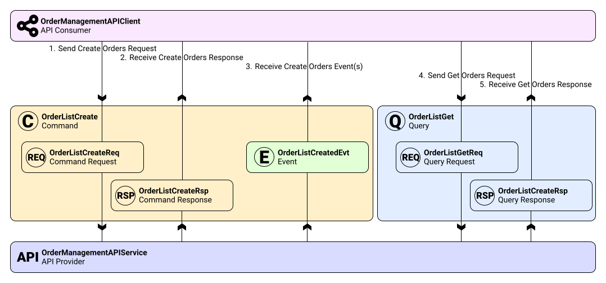

# Generic API Spec

## Overview
This is reference specification with base type definition for API design:

| Type       | Prototype | Description |
| :---       | :----     | :----  |
| Model      | -         | Prototype for business entities |
| Message    | -         | Prototype for messages |
| Command    | -         | Prototype for commands |
| Query      | -         | Prototype for queries |
| Request    | Message   | Prototype for requests |
| Response   | Message   | Prototype for responses |
| Event      | Message   | Prototype for events |
| API        | -         | Prototype for APIs |

Here is chart with example of type usage for Order Management capability:


## Package definition

```cue
package generic_api_spec
```

## Model

A Model represents a fundamental business entity within the domain, encapsulating its state. It serves as a blueprint for data structures that persist within the system, ensuring consistency across different services. Models are typically used to define the schema of resources stored in databases or exchanged between components. They provide a common language for developers and stakeholders to discuss domain concepts without ambiguity. By defining clear boundaries and attributes, Models facilitate data validation and integrity checks throughout the application lifecycle. Properties from Models can be used in Messages.

```cue

#Model: {
  kind: "Model"
  name: string
  meta: {
    [string]: _
  }
  data?: {
    [string]: _
  }
  ...
}
```

## Message

A Message is the base unit of communication in the system, carrying data between different parts of the architecture. It acts as a superclass for more specific communication types like Requests, Responses, and Events. Messages contain metadata such as correlation IDs and timestamps to ensure traceability and proper ordering. They are designed to be immutable payloads that can be serialized and transmitted over networks efficiently. This abstraction allows for a standardized way of handling headers and payloads across various transport protocols.

```cue

#Message: {
  kind: "Message"
  name: string
  meta: {
    // Corellation id of requests in responses
    request_id?: _
    [string]: _
  }
  data?: {
    [string]: _
  }
  ...
}
```

## Command

A Command represents an intent to perform an action that changes the state of the system. It encapsulates all the necessary information required to execute a specific operation or transaction. Commands are distinct from queries because they are expected to produce side effects, such as updating a database. They often follow a strict contract defining the expected input request and the resulting output response or event. Using Commands helps in implementing patterns like CQRS, separating write operations from read operations for better scalability.

```cue

#Command: {
  kind: "Command"
  name: string
  request: #Request
  response: #Response
  error: #Response
  event: #Event
  ...
}

```

## Query

A Query is a request for information that does not modify the state of the system. It is used to retrieve data from the domain, often allowing for filtering, sorting, and pagination. Queries are idempotent, meaning executing the same query multiple times yields the same result without side effects. They define the structure of the request parameters and the expected format of the returned data model. Optimizing Queries independently from Commands allows for specialized read models that improve performance and user experience.

```cue

#Query: {
  kind: "Query"
  name: string
  request: #Request
  response: #Response
  error: #Response
  ...
}

```

## Request

A Request is a specific type of Message sent by a client to initiate an operation or retrieve data. It carries the input parameters and payload necessary for the receiver to process the intent. Requests are often paired with Responses in a synchronous or asynchronous request-reply pattern. They include context information, such as authentication tokens, to authorize the action being requested. Standardizing Request structures ensures that all services can parse and validate incoming traffic consistently.

```cue

#Request: #Message & {
  kind: "Request"
}

```

## Response

A Response is a Message sent back to the client after receiving or processing a Request. It contains the result of the operation, which may include data models, status codes, or error messages. Responses provide feedback to the sender, confirming whether the action was successful or if it failed. They are correlated with the original Request using identifiers to handle asynchronous communication flows correctly. A well-defined Response structure helps clients handle success and failure scenarios gracefully without ambiguity.

```cue

#Response: #Message & {
  kind: "Response"
}

```

## Event

An Event is a Message that signifies a state change or a significant occurrence within the domain. Unlike Commands, Events are facts that have already happened and cannot be rejected or changed. They are broadcast to interested subscribers who can react to the change asynchronously and independently. Events facilitate loose coupling between services, allowing systems to evolve without tight dependencies. They form the backbone of event-driven architectures, enabling features like audit logging and real-time updates.

```cue

#Event: #Message & {
  kind: "Event"
}

```

## API

An API (Application Programming Interface) represents a collection of capabilities exposed by a service or component. It aggregates Commands and Queries into a cohesive interface that defines how external systems can interact with the domain. The API definition serves as a contract, specifying available operations, expected inputs, and potential outputs including events. By grouping related methods and events, it provides a structured view of the service's functionality, facilitating documentation and client generation. This abstraction ensures that the service boundary is clearly defined, promoting modularity and easier integration within larger systems.

```cue

#API: {
  kind: "API"
  name: string
  meta: {
    [string]: _
  }
  // Ordered list of Commands and Queries to expose
  methods: [...#Command | #Query]
  // Extra Events, not mentioned in Commands
  events: [...#Event]
  ...
}

```